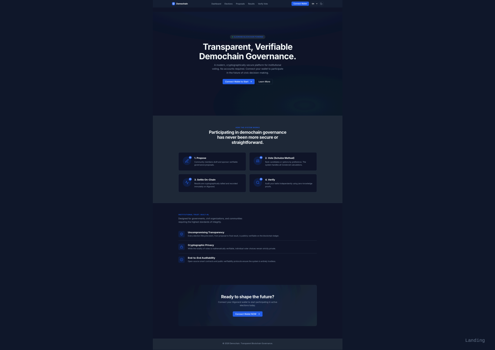
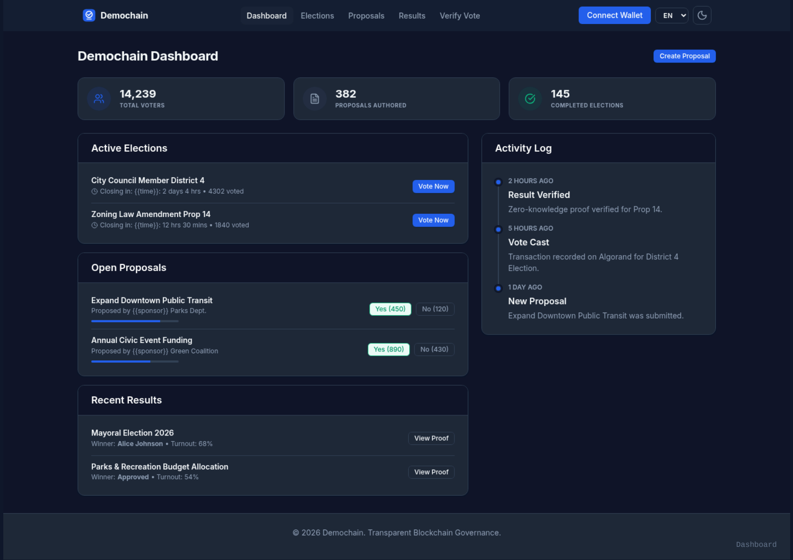
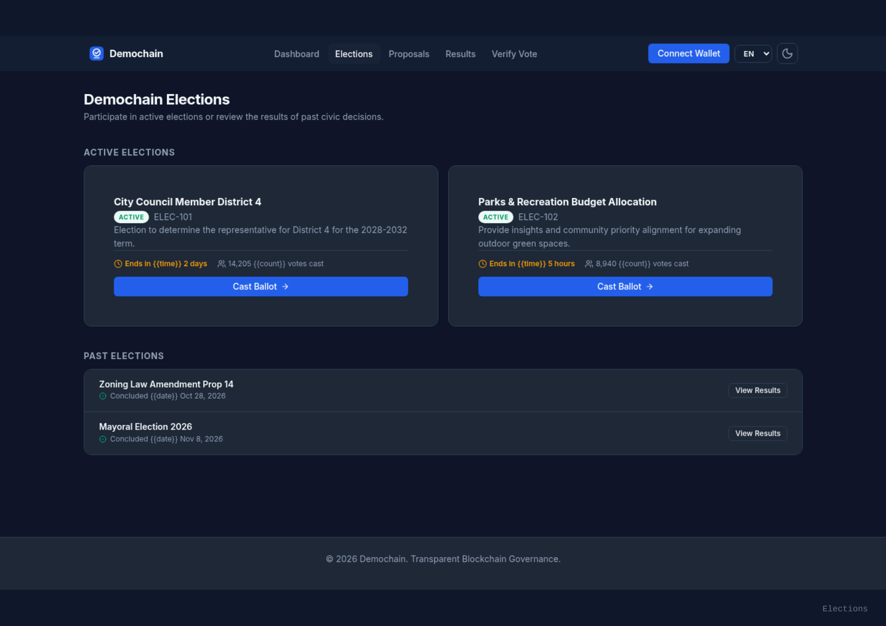
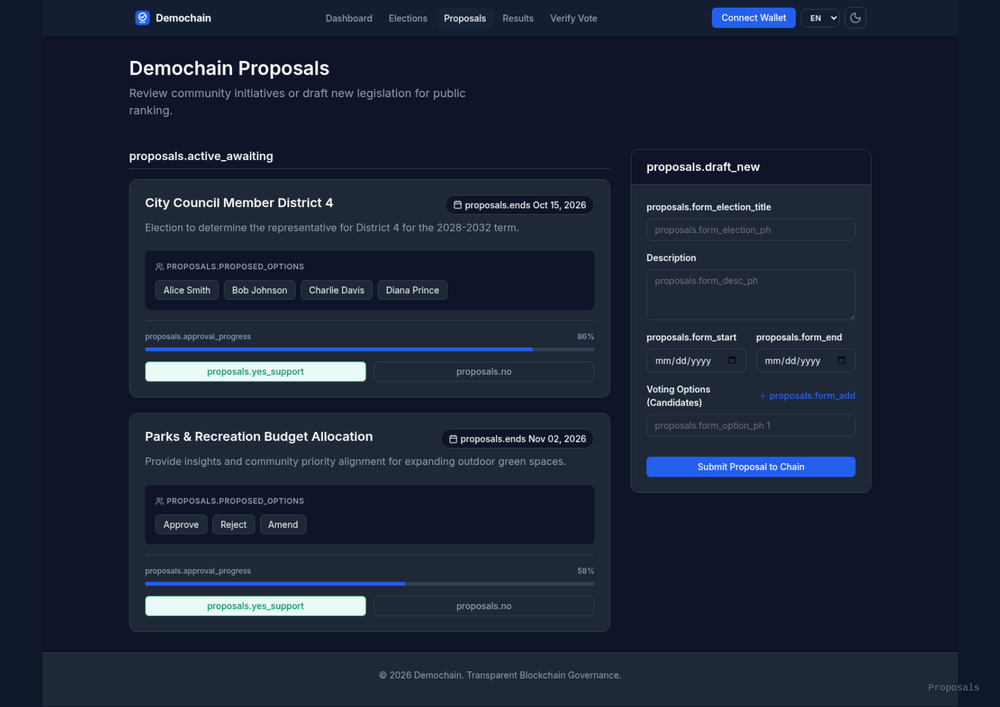
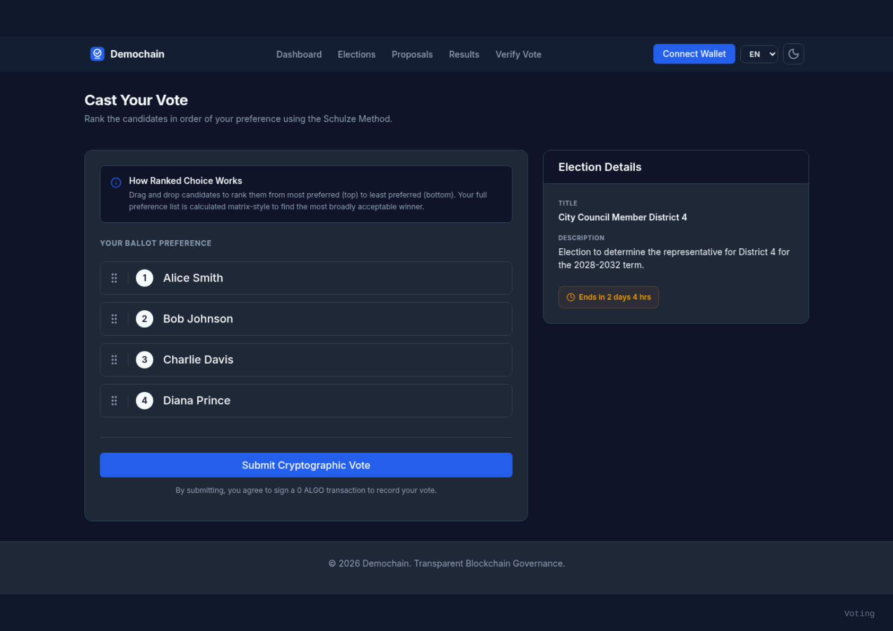
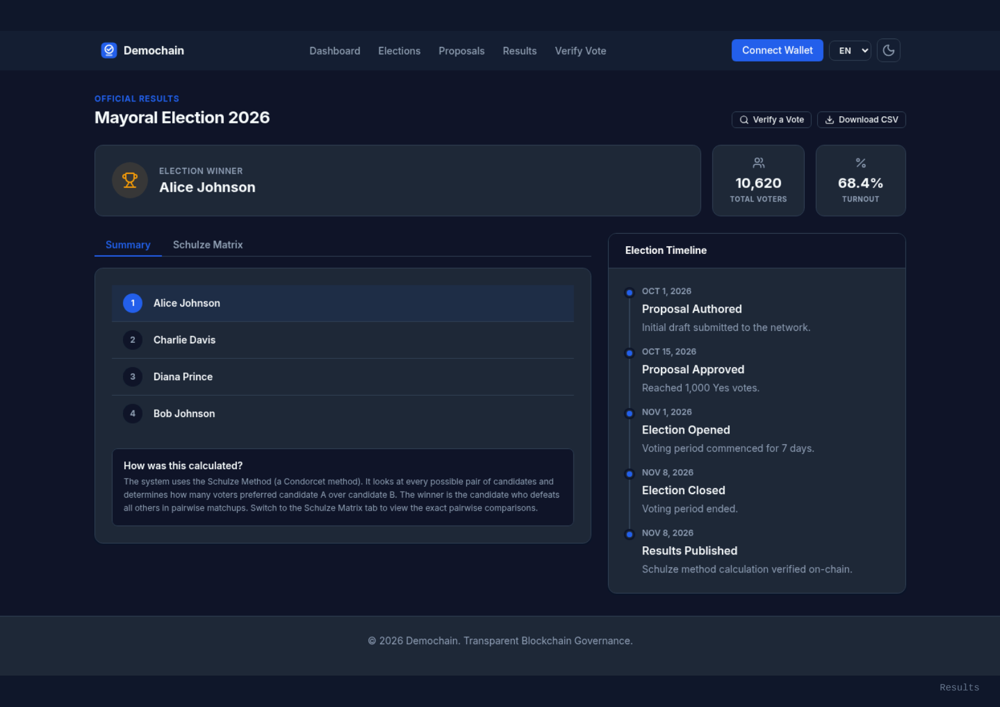
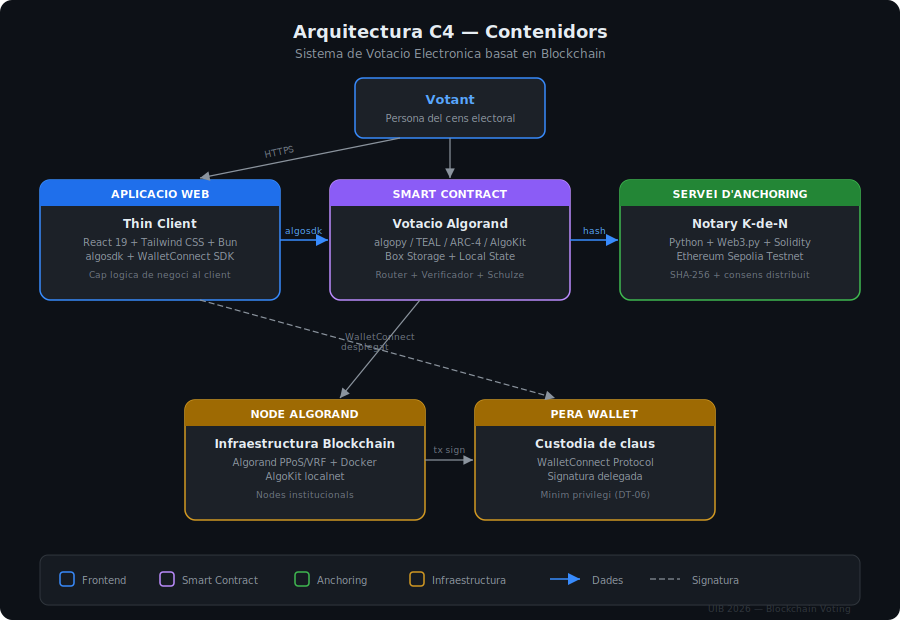

# Blockchain Voting System

Sistema de Votacio Electronica descentralitzat basat en Algorand.
UIB -- 21782 Laboratori de Projectes de Software -- Maig 2026.

---

## Descripcio

Prototip funcional d'un sistema de votacio electronica descentralitzat, segur,
transparent i auditable. Desenvolupat com a projecte formatiu per a l'aprenentatge
de la tecnologia blockchain i els contractes intel·ligents.

El principi fonamental que guia tot el disseny es l'eliminacio del punt unic de
fallada. La logica electoral resideix integrement dins un contracte intel·ligent
immutable desplegat a la xarxa Algorand, i cap servidor intermediari te acces a
les claus privades dels votants.

## Pantalles del mockup

Disseny complet de les 7 pantalles de l'aplicacio (mode fosc, multiidioma EN/ES/CA):

| Landing | Dashboard | Elections |
|---------|-----------|-----------|
|  |  |  |

| Proposals | Voting (Schulze) | Results |
|-----------|------------------|---------|
|  |  |  |

| Verification |
|--------------|
|  |

## Arquitectura

  

El sistema segueix el model C4 amb 4 contenidors principals:

| Contenidor | Tecnologia | Funcio |
|------------|-----------|--------|
| Aplicacio web | React 19 + Tailwind + Bun | Thin Client — cap logica de negoci |
| Smart Contract | algopy / TEAL / ARC-4 | Router + Verificador + Schulze + Propostes |
| Anchoring | Python + Web3.py + Solidity | Notary K-de-N a Ethereum Sepolia |
| Infraestructura | Algorand + Pera Wallet + Docker | Nodes institucionals + custodia claus |

> Mes detalls a la [wiki d'Arquitectura C4](https://github.com/tcontesti/blockchain-voting/wiki/Arquitectura-C4).

## Estat del projecte

| Component | Estat | Responsable |
|-----------|-------|-------------|
| Arquitectura C4 | :green_circle: Completat | Dylan + Toni |
| Abast i requisits (2 entregues) | :green_circle: Completat | Equip |
| Mockup UI (7 pantalles) | :green_circle: Completat | Jordi |
| Smart Contracts (algopy) | :large_blue_circle: En curs — contracte principal implementat | Marc |
| Frontend React + Tailwind | :white_circle: Pendent | Jordi |
| GitHub Actions CI | :white_circle: Pendent | Dylan |
| Servei d'anchoring Python | :white_circle: Pendent | Dylan |
| Ethereum Notary Contract | :white_circle: Pendent | Marc + Dylan |
| Tests E2E (cobertura >= 80%) | :white_circle: Pendent — 25 casos definits | Marc |

### Sprints

| Sprint | Periode | Estat | Progres |
|--------|---------|-------|---------|
| Sprint 1 — Entorn i wallet | 23 feb - 8 mar | Completat | 100% |
| Sprint 2 — Smart Contract votacio | 9 mar - 22 mar | Completat | 100% |
| Sprint 3 — Propostes, recompte i frontend | 23 mar - 12 abr | **Tancat** | ~20% (SC propostes fet, frontend i CI pendents) |
| Sprint 4 — Verificabilitat i anchoring | 13 abr - 3 mai | **En curs** | 0% |
| Sprint 5 — Integracio, QA i doc final | 4 mai - 24 mai | Pendent | 0% |

## Stack tecnologic

| Capa | Tecnologia |
|------|-----------|
| Smart Contracts | algopy (Algorand Python) / TEAL / ARC-4 / AlgoKit |
| Blockchain | Algorand (PPoS/VRF) -- localnet Docker |
| Anchoring | Solidity / Ethereum Sepolia / Web3.py |
| Frontend | React 19 / Tailwind CSS / Bun / algosdk / WalletConnect SDK |
| Wallet | Pera Wallet (WalletConnect) |
| Infraestructura | Docker / docker-compose |
| Tests SC | AlgoKit testing framework (Python) + Hardhat (Solidity) |

## Estructura del repositori

    blockchain-voting/
    contracts/                          # Smart Contracts algopy
      smart_contracts/voting/           # Codi font dels contractes
        contract.py                     # Router principal (5 @abimethod, 10 verificadors)
        verificador.py                  # Documentacio dels 10 verificadors
        logica_votacio.py               # Votacio pluralitat (Schulze pendent)
        logica_propostes.py             # Documentacio logica de propostes
        generador_eleccions.py          # Documentacio generador d'eleccions
        constants.py                    # 10 prefixos BoxMap + constants
        deploy_config.py                # Configuracio de desplegament
      tests/                            # Tests unitaris (AlgoKit)
        test_votacio.py                 # 6 tests votacio
        test_doble_vot.py               # 5 tests prevencio doble vot
        test_propostes.py               # 9 tests propostes i cens
        test_generador.py               # 5 tests generador
      scripts/                          # Scripts de desplegament
        deploy.py
        populate_census.py
    docs/                               # GitHub Pages (landing page)
      img/                              # Diagrames i captures
        arquitectura-c4.svg             # Diagrama d'arquitectura C4

## Prerequisits

- Docker i Docker Compose
- AlgoKit >= 2.0
- Bun >= 1.0 (frontend)
- Python >= 3.12

## Configuracio inicial

    git clone https://github.com/tcontesti/blockchain-voting.git
    cd blockchain-voting
    cp .env.example .env

Edita el fitxer `.env` amb els valors necessaris abans de continuar.

## Instruccions de desplegament

Les instruccions completes de desplegament, configuracio de l'entorn Docker
i AlgoKit, i execucio dels tests s'actualitzaran a mesura que avanci la
implementacio.

## Equip

| Membre | GitHub | Rol |
|--------|--------|-----|
| Toni Contesti | @tcontesti | Cap de Projecte |
| Jordi Vanyo | @jvanyom | Frontend / UX (React, Tailwind, Bun) |
| Marc Link | @linkcla | Smart Contracts (algopy, AlgoKit) / QA |
| Dylan Luigi Canning | @dylanluigi | Arquitectura / Anchoring (Solidity) |

## Documentacio

- [Wiki del projecte](https://github.com/tcontesti/blockchain-voting/wiki)
- [Sprint Board (Kanban)](https://github.com/users/tcontesti/projects/3)
- [Landing page](https://tcontesti.github.io/blockchain-voting/)
- [Backlog](https://github.com/tcontesti/blockchain-voting/issues)
- [Milestones](https://github.com/tcontesti/blockchain-voting/milestones)

---

UIB -- 21782 Laboratori de Projectes de Software -- Maig 2026
